# diary_of_science_work
Дневник для научной работы.

### Список статей и блогов идругих полезных ссылок:
* [1](http://web.eecs.umich.edu/~jabernet/eecs598course/fall2015/web/notes/lec22_120315.pdf)
* [2](https://books.google.ru/books?id=McpmDwAAQBAJ&pg=PA42&lpg=PA42&dq=Ramachandran+Selecting+optimal+source+for+transfer+learning+in+Bayesian+optimisation.&source=bl&ots=xHhpuHu1Nq&sig=ynRb1s6aEE9YaKHSvVH3OfybL34&hl=en&sa=X&ved=2ahUKEwj00v27kPXeAhWPKCwKHQLSBsQQ6AEwBHoECAQQAQ#v=onepage&q=iteration&f=true)
* [3](http://banditalgs.com/2016/10/01/adversarial-bandits/)
* [4](https://arxiv.org/pdf/1506.03271.pdf)
* [5](https://github.com/hibayesian/awesome-automl-papers#reinforcement-learning)
* [6](http://proceedings.mlr.press/v28/bardenet13.pdf)
* [7](http://proceedings.mlr.press/v33/yogatama14.pdf)
* [9](https://papers.nips.cc/paper/5086-multi-task-bayesian-optimization.pdf)
* [10](https://jeremykun.com/tag/exp3/)
* [11](https://arxiv.org/pdf/0912.3995.pdf)
* [12](https://www.sciencedirect.com/science/article/pii/S0957417418305311)
* [13](https://arxiv.org/pdf/1801.00857.pdf)
* [14](https://arxiv.org/pdf/1503.01673.pdf)
* [15](https://arxiv.org/pdf/1805.03463.pdf)
* [16](https://arxiv.org/pdf/0912.3995.pdf)
* [17](https://www.ml4aad.org/wp-content/uploads/2018/12/AutoML-Tutorial-NeurIPS2018-MetaLearning.pdf)
* [18](https://arxiv.org/pdf/1805.10196.pdf)
* [19](https://www.ml4aad.org/wp-content/uploads/2018/11/hpo.pdf)
* [20](https://www.ml4aad.org/wp-content/uploads/2018/12/metalearning.pdf)
* [21](https://arxiv.org/pdf/1502.05700.pdf)
* [22](http://proceedings.mlr.press/v80/lu18c/lu18c.pdf)
* [23](https://storage.googleapis.com/pub-tools-public-publication-data/pdf/bcb15507f4b52991a0783013df4222240e942381.pdf)
* [24](https://www.cs.ubc.ca/~hutter/papers/10-TR-SMAC.pdf)
* [25](https://arxiv.org/pdf/1807.02811.pdf)
* [26](https://arxiv.org/pdf/1206.2944.pdf)
* [27](https://arxiv.org/pdf/1712.00424.pdf)
* [28](https://papers.nips.cc/paper/7111-bayesian-optimization-with-gradients.pdf)

## Chapter 1. Hyperparameter Optimization

В этой главе рассмотрены основные алгоритмы поиска гиперпараметров.

Model-free:  
* grid search:
    Для каждого гиперпараметра выбирается множество значений,а затем оценивается каждый 
    элемент(определенный набор гиперпараметров) прямого произведения этих множеств.
* random grid search:
    Выбираются произвольные наборы гиперпараметров, способ хорош когда несколько гиперпараметров
    гораздо важнее остальных   
        
Population-based:
* CMA-ES(covariance matrix adaption evolutionary strategy ):
    Генерирует популяцию наборов гиперпараметров из многомерной Гауссианы, где параметры распределения
    обновляются от поколения к поколению основываясь на успешных представителях предыдущей популяции. 

Bayesian Optimization:
* Основная идея состоит в следующих ключевых компонентах: вероятностная 'суррогатная' модель (предсказывает 
  функцию потерь для данного набора гиперпараметров) и функционал для выбора нового набора гиперпараметров 
  для реальной оценки функции потерь и уточнения параметров модели-суррогата. Чаще всего в качестве такого
  функционала берут expected improvement. В качестве модели суррогата можно брать гауссовские процессы, 
  random forest и нейросети.

Multi-Fidelity Optimization:
* Полное обучение модели на большом датасете может занимать до нескольких часов, это значит что оценка 
  даже одного набора гиперпараметров обходится непозволительно дорого. Предлагается использовать упрощенное 
  представление о функции потерь(low-fidelity), обучая модель на подмножестве всех объектов и признаков, с
  ограничением на число итераций.
* Один из способов уменьшения временных затрат является преждевременная остановка алгоритма по динамике
  кривой обучения(learning curve).
* Successive halving - на каждом шаге алгоритма отбрасывается худшая половина исследуемых наборов 
  гиперпараметров, ресурсы(выборка, время, вычислительные ресурсы) удваиваются и  делается аналогичный шаг.

Также оговаривается что проблема автоматического обучения часто рассматривается шире, включая в себя автоматический отбор признаков, предобработку данных и выбор алгоритма.

## Chapter 2. Meta-Learning

В этой главе рассматриваются различные подходы в meta-learning.  
  
Learning from Model Evaluations:
* Каждое задание из множества **T** может быть описано как вектор **P** оценок конфигураций $\bf \theta$, простарнство конфигураций может быть представлено гиперпараметрами модели, компонентами архитектуры нейронных сетей и т.д. Необходимо обучить meta-learner **L**, который бы мог для новой задачи найти оптимальную конфигурацию.

* Если о новой задаче ничего не известно, т.е мы не имеем никаких оценок конфигураций для этой задачи, предлагается провести ранжирование конфигураций по известным для них оценкам.  Затем выбрать из K лучших по рангу конфигураций ту, что показала себя лучше всего на новой задаче. Или использовать эти оценки как warm-start для дальнейшей оптимизации.

* Другой подход при неизвестном $P_{new}$ это обучить какую-то дифференцируемую функцию(**surrogate model**), обученную предсказываеть оценку для конфигураций $f_j(\theta_i) = P_{j,i}$. Затем с помощью градиентного спуска находятся $\theta_j^*$. Эти конфигурации для задач близких к новой могут быть полезны для дальнейшей оптимизации. 

* Еще один подход состоит в использовании специальных функций, сэмплирующих конфигурации с наилучшей предсказанной оценкой(**acquisition function**). Предлагается обучить для новой задачи ($\bf t_{new}$), а так же для уже известных задач **surrogate model**. Затем использовать взвешенный **expected improvement** этих моделей при сэмплировании оптимальных конфигураций для $\bf t_{new}$.

* Чтобы отобрать задачи, которые связаны с новой, существует множество подходов. В статье  [**Ramachandran, et.al.: Selecting optimal source for transfer learning in Bayesian optimisation.**](https://books.google.ru/books?id=McpmDwAAQBAJ&pg=PA42&lpg=PA42&dq=Ramachandran+Selecting+optimal+source+for+transfer+learning+in+Bayesian+optimisation.&source=bl&ots=xHhpuHu1Nq&sig=ynRb1s6aEE9YaKHSvVH3OfybL34&hl=en&sa=X&ved=2ahUKEwj00v27kPXeAhWPKCwKHQLSBsQQ6AEwBHoECAQQAQ#v=onepage&q=Ramachandran%20Selecting%20optimal%20source%20for%20transfer%20learning%20in%20Bayesian%20optimisation.&f=false) описан подход с использованием **rl**. Действиями в таком случае выступает выбор той или иной задачи(**source**), которая предположительно близка к новой. Награды пересчитываются следующим образом. Данные source задачи соединяются с данными целевой задачи и на этих данных строится **GP**. Затем с помощью **acquisition function** сэмплируется следующая точка, в ней подсчитывается оценка. Вознаграждением будет квадрат разницы подсчитанной оценки($y$) и предсказанного **GP** среднего в новой точке($\hat{y}$). Вознаграждение используется для пересчета весов каждой из предполагаемых source задач. Веса участвуют в выборе source задачи.

* С этой же целью можно использовать learning curves, которые строятся по мере увеличения выборки. Также анализ таких кривых может сильно ускорить выбор оптимальной конфигурации.

Learning from Task Properties

* В таких методах используются мета признаки, описывающие задачи. На их основе можно выбирать различными способами наиболее близкие к новой.

* Конфигурации для новой задачи можно выбирать с помощью рекомендаций. Задачи рассматриваются как пользователи, а конфигурации как товары. Проблема холодного старта решается следующей процедурой, предложенной в статье [**Feurer et al., 2015**](https://ml.informatik.uni-freiburg.de/papers/15-NIPS-auto-sklearn-preprint.pdf): для датасетов каждого из заданий подсчитываются метапризнаки, выбираются те их конфигурации, которые лучше всего себя показали. Затем для нового датасета выбираются самые близкие к нему задачи, с помощью например L1 метрики на векторах мета-признаков. Лучшие конфигурации самых близких датасетов используются для 'горячего' старта. Решение с помощью рекомендаций также подразумевает создание полезных эмбедингов как для задач так и для конфигураций.

* В статье [**Learning based assistant for data pre-processing**](https://arxiv.org/pdf/1803.01024.pdf) предлагается способ автоматической рекомендации способа предобработки данных, а в [**Automated Image Data Preprocessing with Deep Reinforcement Learning**](https://arxiv.org/pdf/1806.05886v1.pdf) авторы предлагают метод для предобработки изображений.

* В [**AlphaD3M: Machine Learning Pipeline Synthesis**](https://www.cs.columbia.edu/~idrori/AlphaD3M.pdf) применяется self-play RL для построения оптимальной конфигурации.

## ВКР
Тема: Автоматический подбор параметров алгоритмов машинного обучения с помощью обучения с подкреплением

**Эксперимент**: Требуется найти максимум заданной(целевой) функции. Функция - отнормированная сумма двух двумерных гауссиан. Пики функции в точках (0.7;0.7) и (2.7;2.7), ковариационные матрицы гауссиан I и 0.25*I.

Так же даны функции-источники, тоже двумерные суммы гаусиан, но с другими пиками. Рассмотрены три случая:

1) Один релевантный источник 
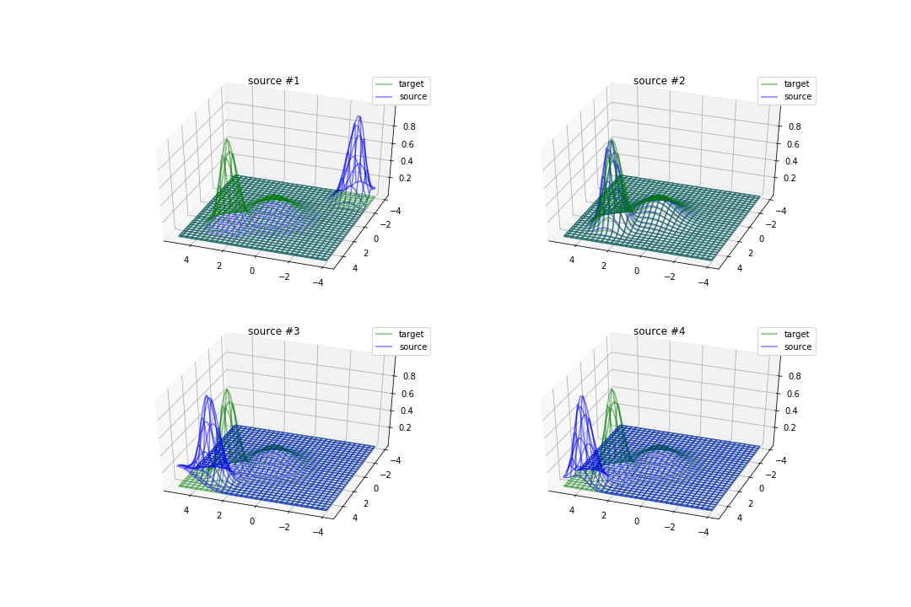

2) Два релевантных источника 
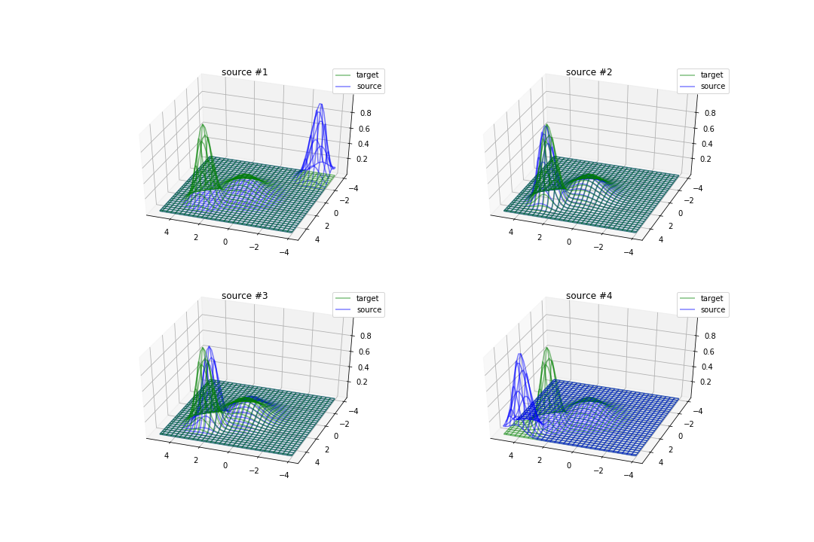

3) Без релевантных источников(проверка на negative transfer) 
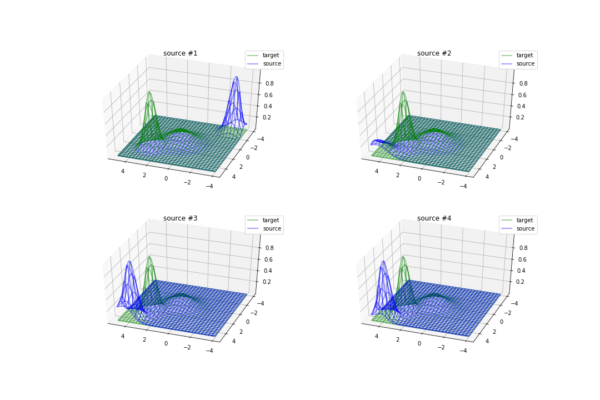

В качестве acquisition function выбрана GP-UCB, параметр beta убывает с числом итераций в последних двух экспериментах. В каждом из экспериментов оптимизация проводилась четыремя методами: 
* без transfer learning
* Активный выбор источника алгоритмом **exp3**
* Активный выбор источника алгоритмом **exp3-IX**
* Построение общего для близких(отобранных с помощью мета-признаков) датасетов оптимизационного пространства. Т.е каждый набор гиперпараметров для каждого датасета описывается вектором длины D+d, где D-длина описания набора гиперпараметров, а d-длина описания датасета. Метод описан [здесь](http://proceedings.mlr.press/v33/yogatama14.pdf) и взят в упрощенном виде. Сделано предположение, что раз функции представимы в виде суммы гаусиан, то они уже достаточно близки, поэтому каждый источник представлен в виде соответствующего one-hot вектора.  

Для каждого источника известно 100 значений в точках из прямоугольника x in [-4.5,5] y in [-4.5,5]. Максимум acquisition function ищется по сетке из 900 точек + 5 произвольных точек, из которых запускается градиентный подъем. В каждом эксперименте изначально известно значение целевой функции в 2-х прозвольных точках. Для стабильности результатов, проводится усреднение по 10-ти запускам процедуры, каждый раз берутся новые начальные точки.

Результаты экспериментов:

| one source | two sources | no source |
| :-------------: | :-------------: | :-------------: |
| 
  | 
  | 
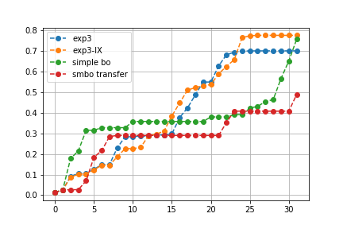 |

Полученые функциональные приближения:

|   |  |
| ------------- | ------------- |
| 
  | 
  |
| 
  | 
  |

|   |  |
| ------------- | ------------- |
| 
  | 
  |
| 
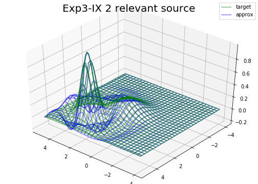  | 
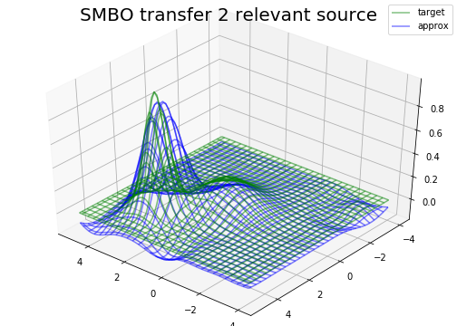  |

|   |  |
| ------------- | ------------- |
| 
  | 
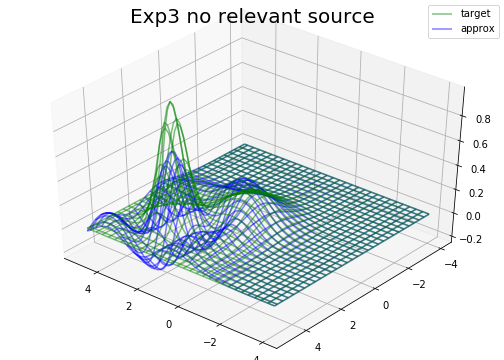  |
| 
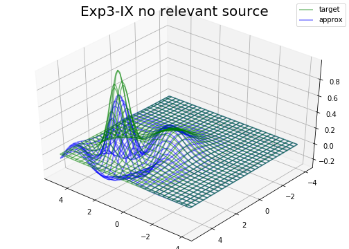  | 
  |

Выбор рук в экспериментах:

| |exp3  | exp3-IX |
| ------------- | ------------- | ------------- |
|one source(#2)| 
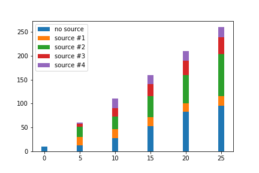 | 
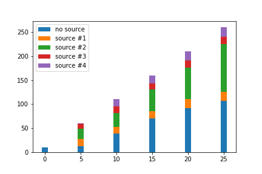 |
|two sources(#2,3)| 
 | 
 |
|no source| 
 | 
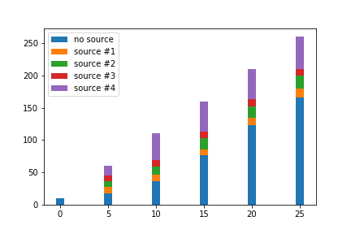 |

Что можно сделать еще:
* выбор источника: применять разных бандитов(выбор руки из распределения|детерменированный: максимальная вероятность)
* Выбор лосса: $(f(x_t) - \mu_{s_t}(x_t))^2$ или $(1 - f(x_t))^2$ (второй в экспериментах показал себя хуже, но и  первого есть недостатки, связаные с параметром beta в UCB. Можно попробовать их комбинацию или что-то новое) 
* Возможные опции работы со средами источниками: envelope-gp|| [общее функциональное пространство](http://proceedings.mlr.press/v33/yogatama14.pdf)
* оптимизация Acqusition: https://arxiv.org/pdf/1805.10196.pdf, DIRECT, градиентные методы
* как обрабатывать категориальные признаки: вместо gp нейросети, деревья|| автокодировщик|| https://arxiv.org/pdf/1805.03463.pdf
* попробовать применить к реальной задаче
* Допустим у нас есть различные датасеты на которых уже оценены какие-то наборы гиперпараметров, тогда можно дешево применить бандитов к ним и узнать как они связаны друг с другом. таким образом можно понять как источники коррелируют друг с другом, тогда можно разбить датасеты на классы эквивалентности и оценить только представителей этих классов в качестве источников. Меньше рук -> быстрее exploration.  
**Плюсы**: никаких мета признаков,не зависит от того в каких именно точках оценен каждый источник. Если строить рекомендательную систему по векторам из уже оцененных точек для каждого источника возникают проблемы(точки разные, разное количество и т.д), наш метод с этими проблемами не сталкивается.  
**Минусы**: кубическая сложность обучения GP.

* В ходе экспериментов выясноилась интересная связб между коэфициентом $\beta$ в UCB и связанностью источников. Если только один источник то можно смело брать коэффициент порядка 100, при нескольких источниках процесс сходится быстрее, значит шаг необходимо уменьшать, тогда результаты становятся значительно лучше. При отсутствии хороших источников и высоком значении коэффициента происходит случайное блуждание по разным источникам, они становятся равномерными. Можно использовать данные наблюдения для анализа источников, их релевантности.

* Можно подбирать beta с помощью RL опять же, тут и пригодится второй лосс $(1 - f(x_t))^2$