### Research
**Subject**: Automatic parameters selection for machine learning algorithms with reinforcement learning.		

**Annotation**: Purpose of this work is [further](https://books.google.ru/books?id=McpmDwAAQBAJ&pg=PA42&lpg=PA42&dq=Ramachandran+Selecting+optimal+source+for+transfer+learning+in+Bayesian+optimisation.&source=bl&ots=xHhpuHu1Nq&sig=ynRb1s6aEE9YaKHSvVH3OfybL34&hl=en&sa=X&ved=2ahUKEwj00v27kPXeAhWPKCwKHQLSBsQQ6AEwBHoECAQQAQ#v=onepage&q=iteration&f=true) research on problem of number of iterations decrease of hyperparameters optimization procedure.

**Prorposed ideas**: Increase efficiensy of hyperparameters selection with transfer learning. Further speed up(in term of number of iterations) the aforementioned procedure actively choosing source of transfer with multiarmed bandits algorithm. Decrease variance in hyperparameters tuning procedure with [EXP3-IX](https://arxiv.org/pdf/1506.03271.pdf) algorithm. Fine tuning parameter of GP-UCB acquisition function with REINFORCE algorithm.     

**Method's work**: Method's work is mostly similar to one described [here](https://books.google.ru/books?id=McpmDwAAQBAJ&pg=PA42&lpg=PA42&dq=Ramachandran+Selecting+optimal+source+for+transfer+learning+in+Bayesian+optimisation.&source=bl&ots=xHhpuHu1Nq&sig=ynRb1s6aEE9YaKHSvVH3OfybL34&hl=en&sa=X&ved=2ahUKEwj00v27kPXeAhWPKCwKHQLSBsQQ6AEwBHoECAQQAQ#v=onepage&q=iteration&f=true) due to proposed method is modification of aforementioned method. Main difference is update of acquisition function's parameter: 
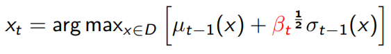

update is performed as follows: 
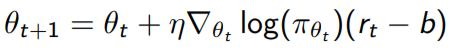

where reward is: 
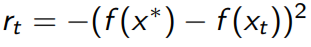

**Experiments**: HPO problem can be stated as black-box optimization problem. Function to be optimized is machine learning algorithm perfomance from hyperparameters. For this experiment we use a summ of two normalized Gaussians with different parameters to play role of aforementioned perfomance function. Then we try to find global maximum of this function with differnt methods:
* no transfer learning
* active choose of transfer with **exp3**
* active choose of transfer with **exp3-IX**
* active choose of transfer with **exp3-IX** and tuning of acquisition's parameter 
* method from [article](http://proceedings.mlr.press/v33/yogatama14.pdf)

Optimized function has two peaks at (0.7;0.7) and (2.7;2.7), gaussians have covariance matrices I and 0.25\*I, where I - is identity matrix.

Dependency of algorithm's work from number of relevant transfer learning sources was also studied. Sources were also sums of gaussians with same covariance matrices as target function but peaks were different. Some sources are closer to target (in terms of euclidean distance) and treated as relevant others are irrelevant.

Three options were studied:

1) One relevant source 

2) Two relevant sources 

3) No relevant sources 

There are 100 known values for every source of transfer within bounds [-4.5,5] for x and [-4.5,5] for y. Maximum of acquisition function was sought among 900 points from grid and points found with gradient ascend started from 5 arbitrary points. For each scenario there are only 2 starting points. For stabilty of results experiments are repeated for 10 times and then results are averaged.

**Results**:

 one source 
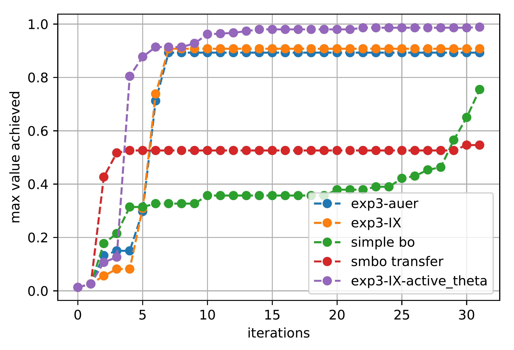

 two sources 
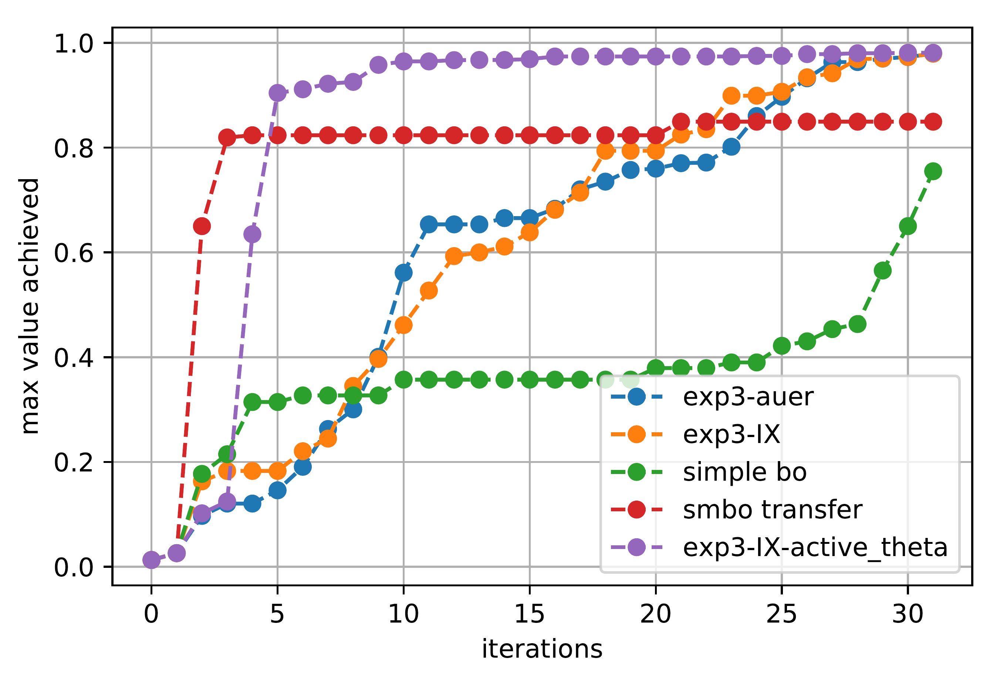

 no sources 
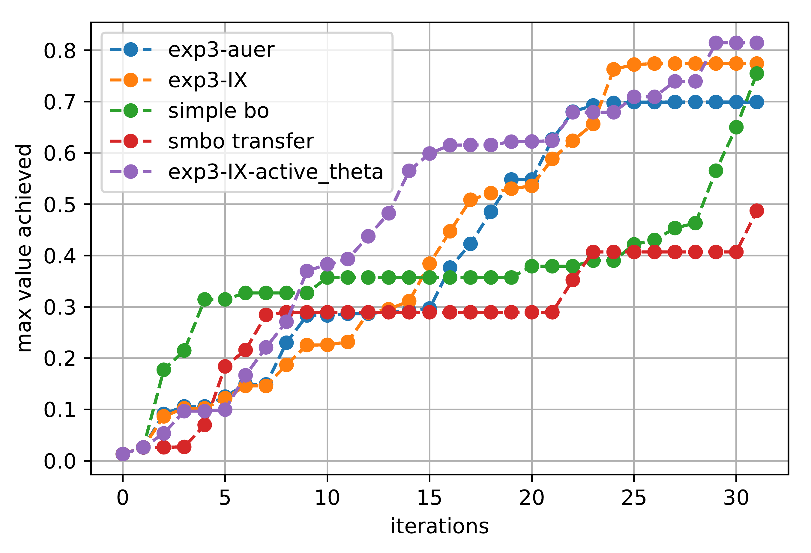

Distribution of choices over sources for transfer learning:

| |exp3  | exp3-IX |
| ------------- | ------------- | ------------- |
|one source(#2)| 

 | 
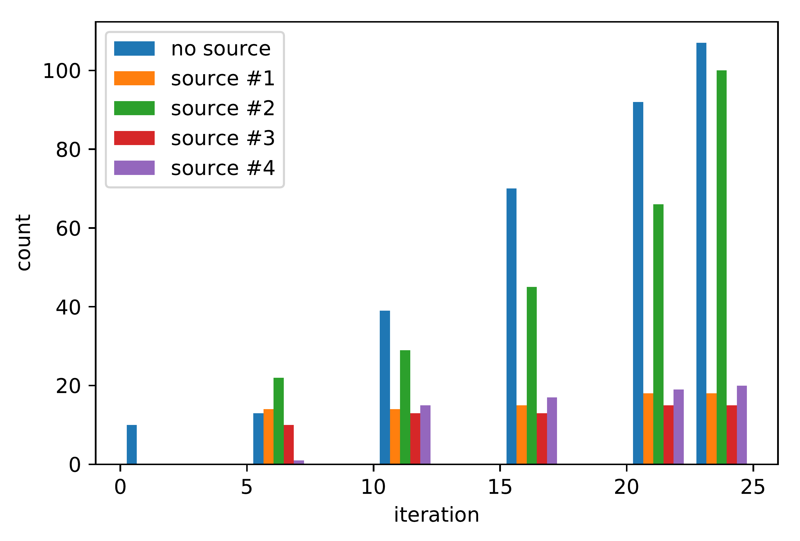
 |
|two sources(#2,3)| 
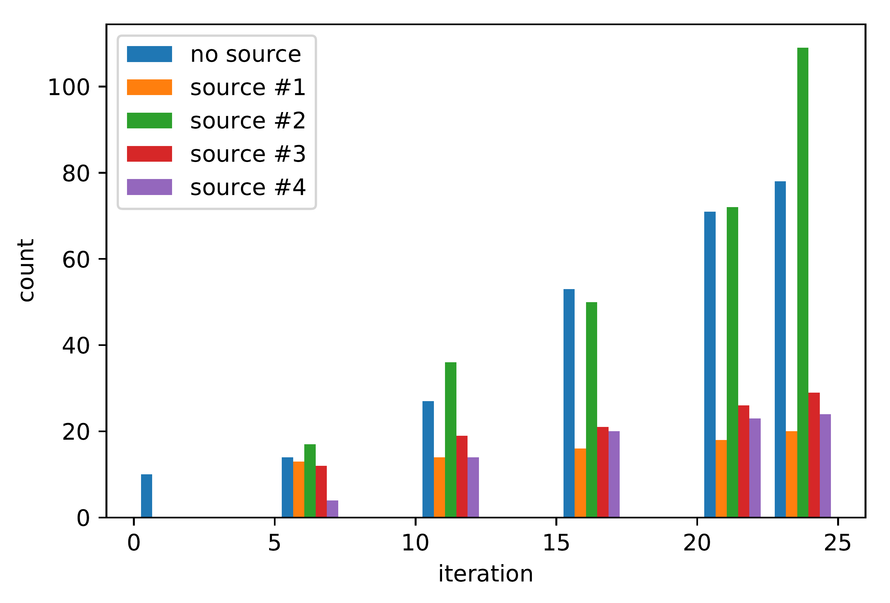
 | 
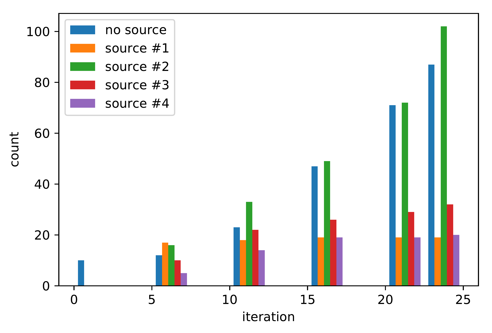
 |
|no source| 
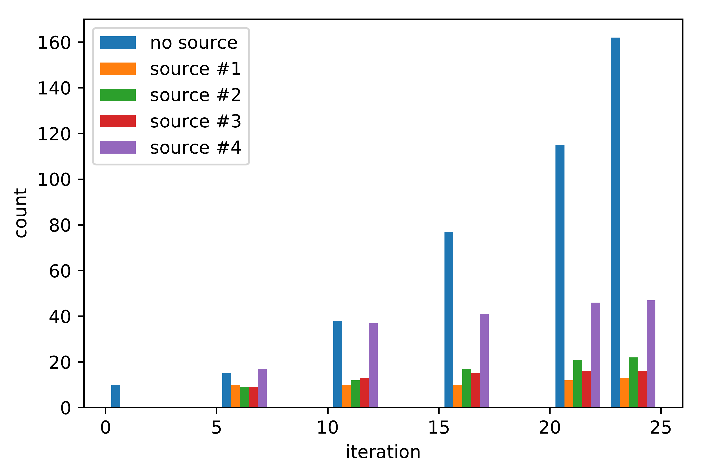
 | 
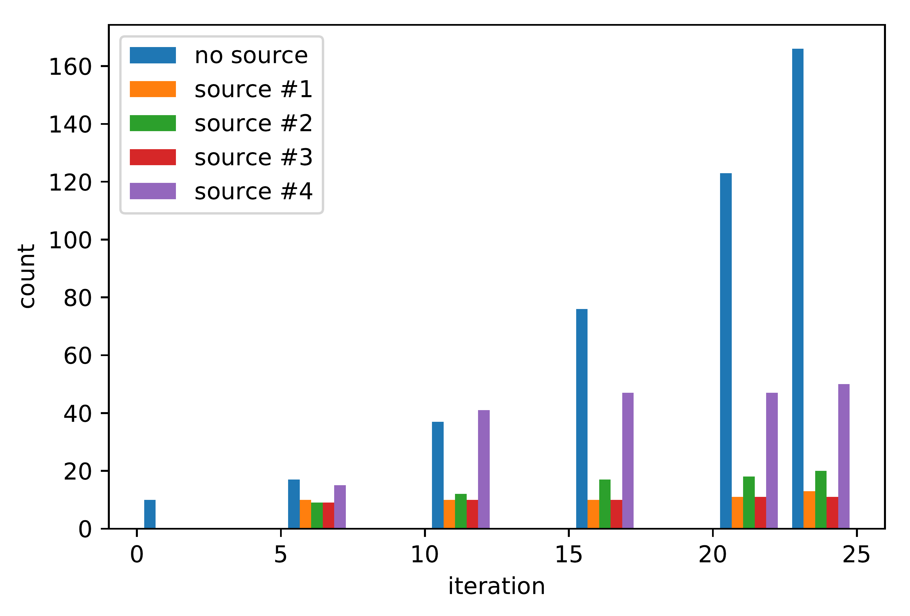
 |

### List of useful articles:
1. [Lecture on Adversarial Bandits - Lecture](http://web.eecs.umich.edu/~jabernet/eecs598course/fall2015/web/notes/lec22_120315.pdf)
* [Selecting Optimal Source for Transfer Learning in Bayesian Optimisation - Article](https://books.google.ru/books?id=McpmDwAAQBAJ&pg=PA42&lpg=PA42&dq=Ramachandran+Selecting+optimal+source+for+transfer+learning+in+Bayesian+optimisation.&source=bl&ots=xHhpuHu1Nq&sig=ynRb1s6aEE9YaKHSvVH3OfybL34&hl=en&sa=X&ved=2ahUKEwj00v27kPXeAhWPKCwKHQLSBsQQ6AEwBHoECAQQAQ#v=onepage&q=iteration&f=true)
* [Blog Post on Adversarial Bandits - Blog](http://banditalgs.com/2016/10/01/adversarial-bandits/)
* [Implicit Exploratioin Bandit - Article](https://arxiv.org/pdf/1506.03271.pdf)
* [Awesome-AutoML-Papers - git](https://github.com/hibayesian/awesome-automl-papers#reinforcement-learning)
* [surrogate-based collaborative tuning (SCoT) - Article](http://proceedings.mlr.press/v28/bardenet13.pdf)
* [Efficient Transfer Learning Method for Automatic Hyperparameter Tuning - Article](http://proceedings.mlr.press/v33/yogatama14.pdf)
* [Multi-Task Bayesian Optimization - Article](https://papers.nips.cc/paper/5086-multi-task-bayesian-optimization.pdf)
* [Bandits and Stocks - Blog](https://jeremykun.com/tag/exp3/)
* [Gaussian Process Optimization in the Bandit Setting: No Regret and Experimental Design (theoretical analysis on GP-UCB) - Article](https://arxiv.org/pdf/0912.3995.pdf)
* [A flexible transfer learning framework for Bayesian optimization with convergence guarantee (Envelope GP) - Article](https://www.sciencedirect.com/science/article/pii/S0957417418305311)
* [Optimal Bayesian Transfer Learning (jia) - Article](https://arxiv.org/pdf/1801.00857.pdf)
* [High Dimensional Bayesian Optimisation and Bandits via Additive Models - Article](https://arxiv.org/pdf/1503.01673.pdf)
* [Dealing with Categorical and Integer-valued Variables in Bayesian Optimization with Gaussian Processes - Article](https://arxiv.org/pdf/1805.03463.pdf)
* [NeurIPS 2018 Tutorial on Automatic Machine Learning - Slides](https://www.ml4aad.org/wp-content/uploads/2018/12/AutoML-Tutorial-NeurIPS2018-MetaLearning.pdf)
* [Maximizing acquisition functions for Bayesian optimization - Article](https://arxiv.org/pdf/1805.10196.pdf)
* [Hyperparameter Optimization - Book](https://www.ml4aad.org/wp-content/uploads/2018/11/hpo.pdf)
* [Meta-Learning - Book](https://www.ml4aad.org/wp-content/uploads/2018/12/metalearning.pdf)
* [Scalable Bayesian Optimization Using Deep Neural Networks - Article](https://arxiv.org/pdf/1502.05700.pdf)
* [Structured Variationally Auto-encoded Optimization - Article](http://proceedings.mlr.press/v80/lu18c/lu18c.pdf)
* [Google Vizier: A Service for Black-Box Optimization - Article](https://storage.googleapis.com/pub-tools-public-publication-data/pdf/bcb15507f4b52991a0783013df4222240e942381.pdf)
* [Sequential Model-Based Optimization for General Algorithm Configuration - Overwiew Article](https://www.cs.ubc.ca/~hutter/papers/10-TR-SMAC.pdf)
* [A Tutorial on Bayesian Optimization - Overview Article](https://arxiv.org/pdf/1807.02811.pdf)
* [PRACTICAL BAYESIAN OPTIMIZATION OF MACHINE LEARNING ALGORITHMS - Article](https://arxiv.org/pdf/1206.2944.pdf)
* [The reparameterization trick for acquisition functions - Article](https://arxiv.org/pdf/1712.00424.pdf)
* [Bayesian Optimization with Gradients - Article](https://papers.nips.cc/paper/7111-bayesian-optimization-with-gradients.pdf)
